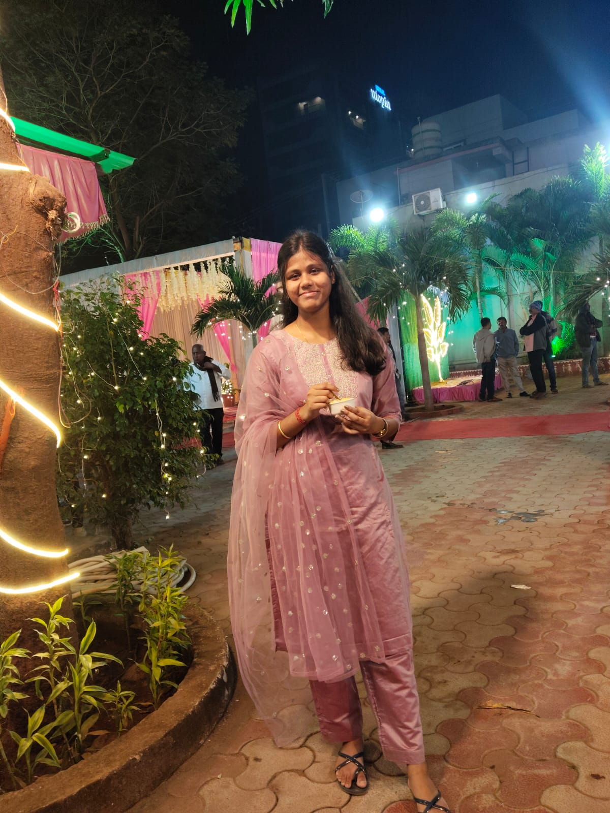
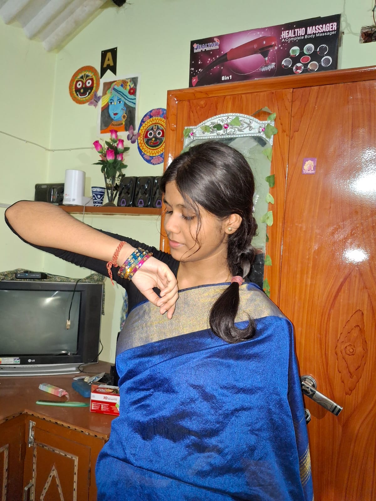
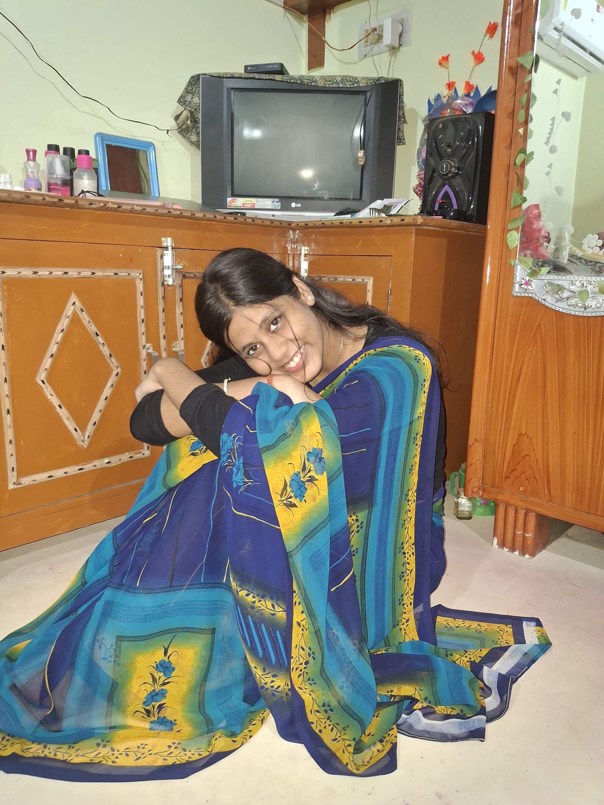
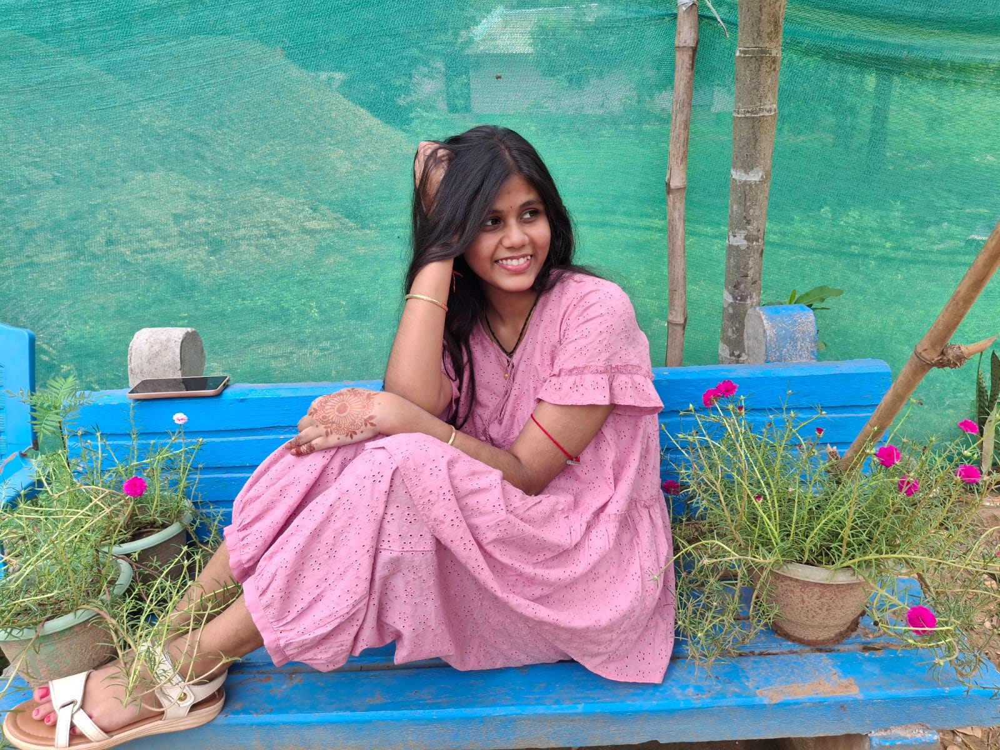
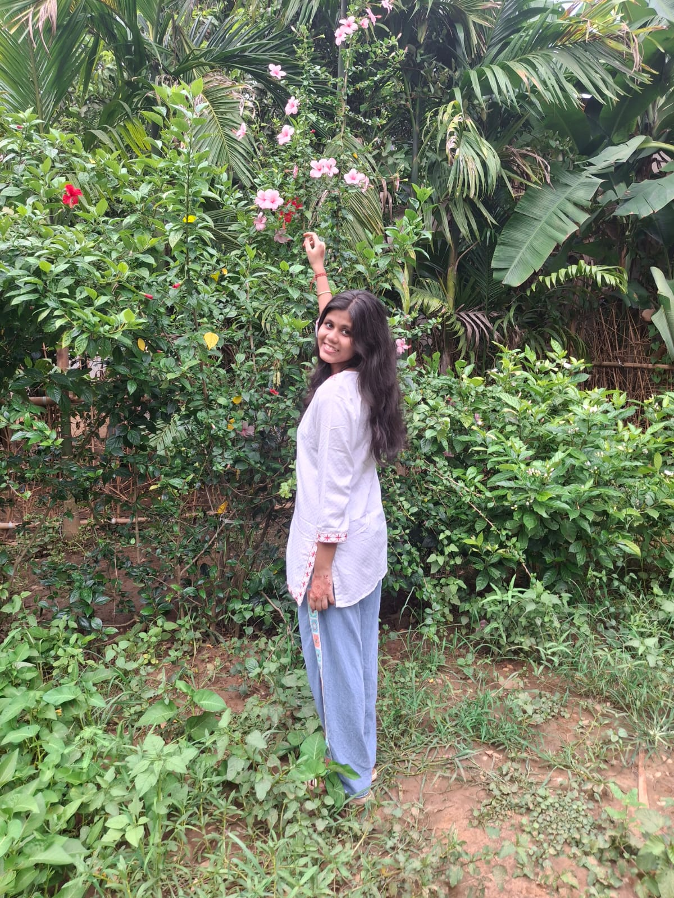
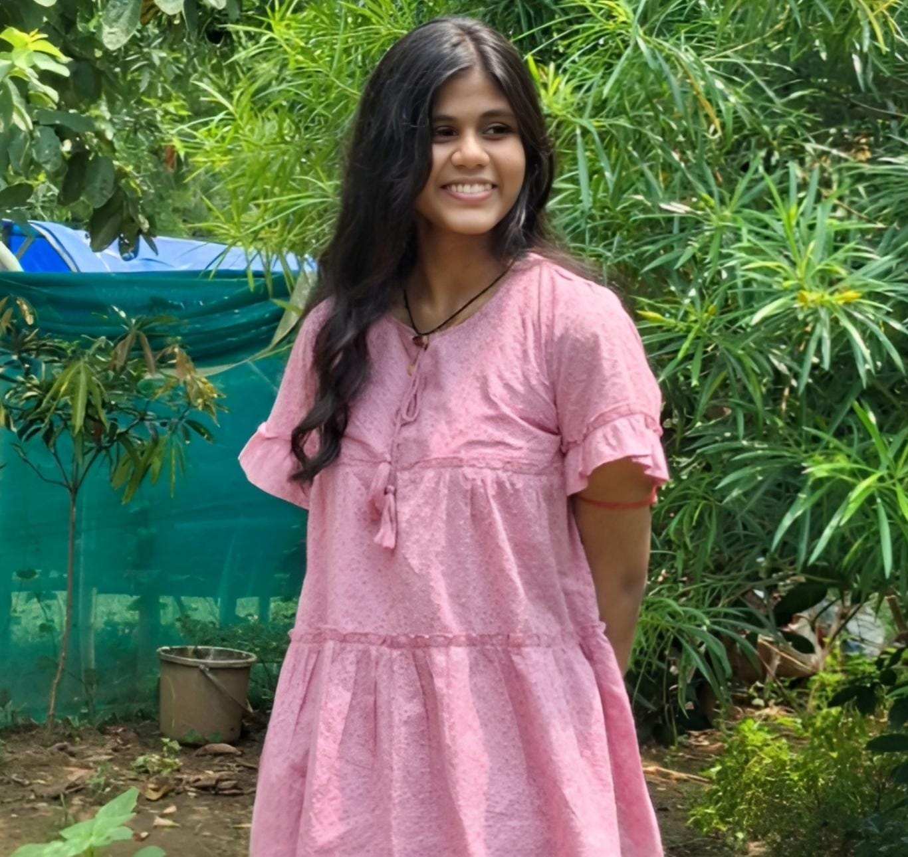
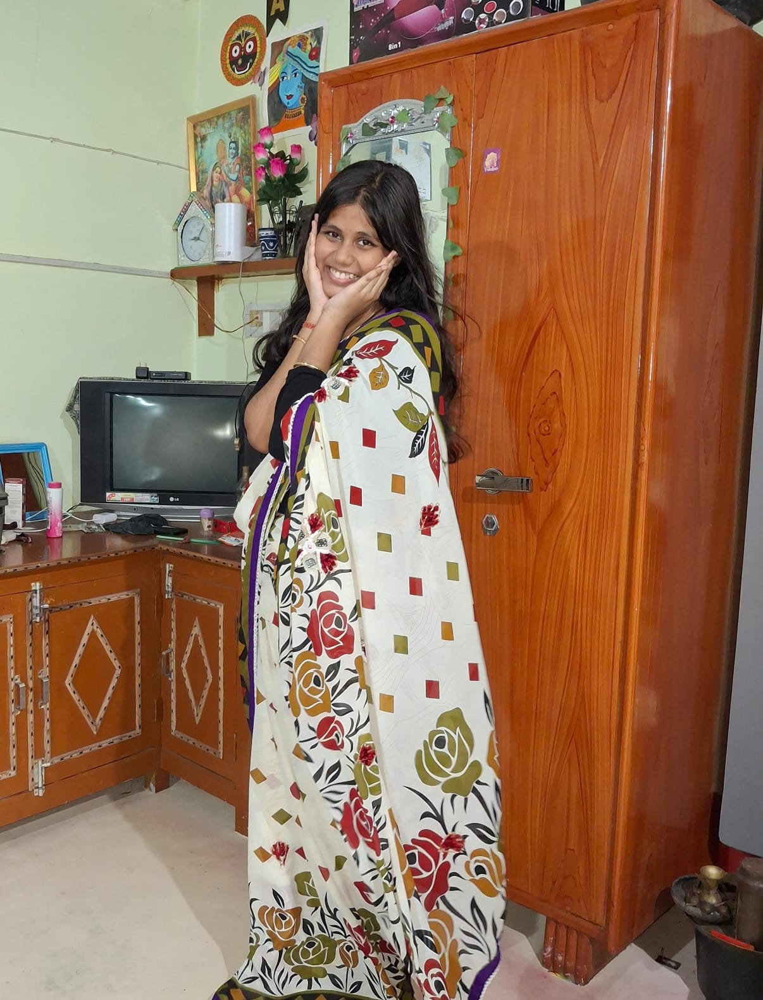
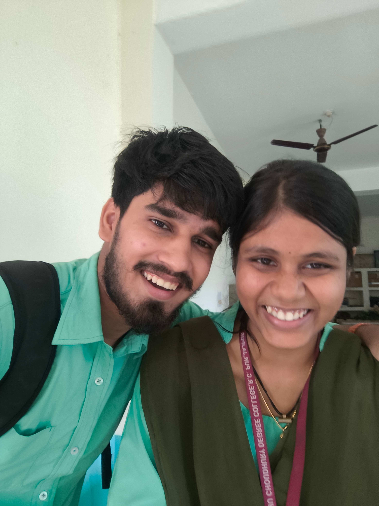
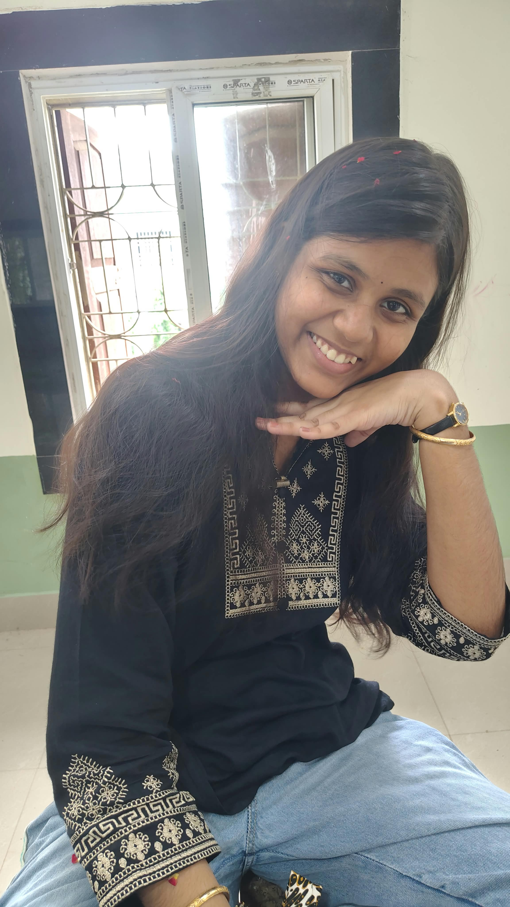
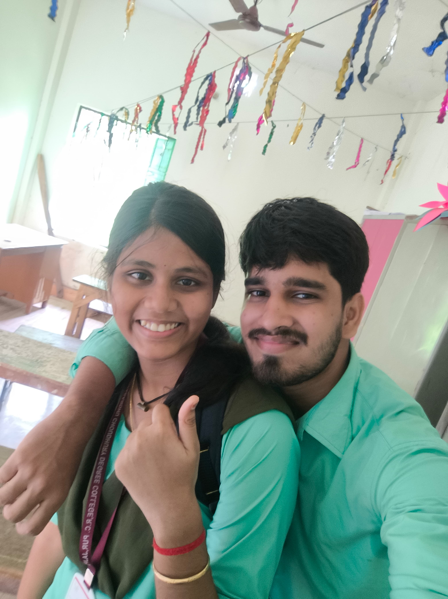

<!DOCTYPE html>
<html lang="en">
<head>
<meta charset="UTF-8">
<meta name="viewport" content="width=device-width, initial-scale=1">
<meta name="theme-color" content="#ffe4ef">
<title>For My Kyuutu ♡</title>

</head>

<body class="locked">

<!-- Decorative hearts and stars stay above the page without blocking taps -->

<!-- BIRTHDAY LOCK: SONG IS PLAYABLE BEFORE UNLOCK -->

  

    
🎀💗🦋

    
A little surprise is waiting

    <h1>For My <em>Kyuutu</em> ♡</h1>
    
Dear Anuska, this little world was made just for you, with memories, music and tiny surprises. 🌷

    

      
A song picked just for you 🎶

      <h3>Tera Naam Doon ♡</h3>
      
A little birthday soundtrack for my favourite girl. 💗

      <audio id="topSong" controls loop preload="metadata">
        <source src="Tera%20Naam%20Doon%20Entertainment%20320%20Kbps.mp3" type="audio/mpeg">
        Your browser does not support this audio file.
      </audio>
      

        0:00
        0:00
      

      

        

      

      
Tap play to listen 🎧

    

    

      
<strong id="lockDays">--</strong><small>DAYS</small>

      
<strong id="lockHours">--</strong><small>HOURS</small>

      
<strong id="lockMinutes">--</strong><small>MINUTES</small>

      
<strong id="lockSeconds">--</strong><small>SECONDS</small>

    

    
Your birthday surprise unlocks at midnight. 💌

    
5 October 2026 · 12:00 AM IST ♡

  

<nav>
  <a class="brand" href="#home">♡ Kyuutu's World</a>
  

    <a href="#birthday">Birthday</a>
    <a href="#memories">Photos</a>
    <a href="#letter">Letter</a>
    <a href="#music">Song</a>
    <a href="#final">Surprise</a>
  

</nav>

<main>
<section class="hero" id="home">
  
A little world made with love

  <h1>For my <em>Kyuutu</em> ♡</h1>
  
To my favourite girl, Anuska. This little world is made just for you, with sweet memories, tiny surprises and a whole lot of love.

  
💗

  
Made with love by Biraja Prasad Jena

  <a class="btn" href="#birthday">Enter your little world ↓</a>
  
20 little corners, one special girl 🌷

</section>

<section id="birthday">
  

Save the date
<h2>It's your day, Kyuutu 🎂</h2>
October 5 is special because the world welcomed you.

  

    
Counting down to your birthday…

    

      
<strong id="days">--</strong><small>DAYS</small>

      
<strong id="hours">--</strong><small>HOURS</small>

      
<strong id="minutes">--</strong><small>MINUTES</small>

      
<strong id="seconds">--</strong><small>SECONDS</small>

    

    
Wishing you all the happiness in the world. 💕

  

</section>

<section id="greeting">
  

A message for you
<h2>Happy Birthday, Anuska! 🌷</h2>

  

    🎂🌸🎀
    
Today is a celebration of you — your dreams, your laughter, your kindness and every little thing that makes you who you are.

    
May this new chapter bring peaceful days, beautiful opportunities, genuine smiles and people who treat your heart with care.

    <a class="btn" href="#memories">Let's look at our memories ♡</a>
  

</section>

<section id="memories">
  

Little moments, big feelings
<h2>Our memory corner 📸</h2>
Tap any picture to see it bigger. Twelve little spaces for memories to treasure.

  

    

A favourite moment ♡

    

A little memory 🌷

    

You make moments special ✨

    

One for the memory book 💗

    

Sweet little memories 🌸

    

Another moment to keep ♡

    

Little things, big feelings 💕

    

A lovely little moment ✨

    

One more for us 🌷

    

Something to smile about 😊

    

Memories worth keeping 💗

    

More memories to come ♡

  

  
A little gallery made just for you.

</section>

<section id="scrapbook">
  

A page from our scrapbook
<h2>Little things to remember 📔</h2>

  

    📷💌🌷
    
Some memories are loud and exciting. Others are tiny moments, simple words or a conversation that makes you smile later.

    
This page is a reminder that lovely memories don't have to be perfect or extraordinary. Sometimes, the smallest things become the ones we cherish.

    Little momentsReal smilesSweet memoriesMore to come
  

</section>

<section id="story">
  

Every story has little chapters
<h2>Our story, one step at a time 🌙</h2>
Edit these captions whenever you want to add your own special dates.

  

    
<strong>Chapter 1 — The beginning 🌸</strong>
Every meaningful story starts somewhere. This is a little space for the beginning of ours.

    
<strong>Chapter 2 — Getting to know you 💬</strong>
Little conversations, discovering the things that make each other smile, and learning more along the way.

    
<strong>Chapter 3 — Little memories 📸</strong>
Moments that become special because we remember how they made us feel.

    
<strong>Chapter 4 — Today, and what's ahead 💗</strong>
Celebrating you today and leaving room for many more lovely chapters in the future.

  

</section>

<section id="adore">
  

The little things
<h2>Things I adore about you 🌷</h2>

  

    🎀🌸🦋
    
Your unique personality, the little things that make you laugh, the way you have your own dreams and ideas, and the person you continue to become.

    
You don't have to be perfect to be appreciated. You deserve to be valued for who you are, on ordinary days as much as special ones.

  

</section>

<section id="reasons">
  

Tap to discover
<h2>Reasons you're special 💕</h2>
Open each card for a little reminder.

  

    <button class="reason">🌸Reason one…I appreciate the unique person you are.</button>
    <button class="reason">😊Reason two…Your smile can make an ordinary moment feel special.</button>
    <button class="reason">🫶Reason three…I value the trust we build by being honest with each other.</button>
    <button class="reason">✨Reason four…You have your own magic. You don't need to be anyone else.</button>
    <button class="reason">🌷Reason five…I love learning the little things that make you happy.</button>
    <button class="reason">💗One last reason…Being yourself is already something special, Kyuutu.</button>
  

</section>

<section id="letter">
  

Just between us
<h2>A letter from me 💌</h2>
Tap the envelope to open your letter.

  

    <button class="envelope" id="envelope" aria-label="Open the birthday letter">💌</button>
    
Tap to open your letter

  

  <article class="letter" id="letterContent"><h3>To my Kyuutu, Anuska ♡</h3>
Happy Birthday, my girl! 🎂💗

I may not always find the perfect words, but today I want you to know how special you are to me.

Thank you for being yourself, for your little ways, your smile, and the moments that become beautiful simply because you're part of them. Even a small conversation can make an ordinary day feel different.

For this new year of your life, I wish you peace, happiness, courage for your dreams, good health, and countless reasons to smile. I hope you always remember that you matter and deserve kindness, respect and beautiful things.

I don't expect every day to be perfect. I hope we continue to understand each other, speak honestly, respect each other, and make lovely memories along the way.

This website is a little birthday gift, made with thought and affection, to celebrate the wonderful person you are.

Keep smiling, keep dreaming, and keep being your adorable self.

Happy Birthday once again, my Kyuutu. 🌷

With lots of love,
Your Biraja ♡</article>
</section>

<section id="music">
  

A song for my girl
<h2>Our little soundtrack 🎶</h2>

  

    🎧💗🎵
    <h3>Tera Naam Doon ♡</h3>
    
The song player is available on the birthday countdown screen. ♡

    <a class="btn light" href="#birthdayLock">Go to the song ↑</a>
    
Tap play whenever you're ready to listen.

  

</section>

<section id="cake">
  

Time for cake
<h2>A little virtual birthday cake 🎂</h2>
Tap the cake to celebrate!

  

    <button class="cake" id="cakeButton" aria-label="Celebrate with cake">🎂</button>
    
🕯️ 🕯️ 🕯️

    
Three little candles, a world of wishes.

    <button class="btn" id="cakeCelebrate">Celebrate! 🎉</button>
  

</section>

<section id="wish">
  

Make a wish
<h2>A wish for your new chapter 🌟</h2>

  

    🌙✨🌸
    
Take a little moment for yourself. Think of a dream you're excited about, a place you'd like to see, a skill you'd like to learn or something that would bring you joy.

    <button class="btn" id="wishButton">I've made my wish ♡</button>
    
Your wish is yours to keep. 💗

  

</section>

<section id="jar">
  

A jar of kind words
<h2>Pick a little compliment 🌷</h2>
Tap the jar whenever you need a smile.

  

    <button class="jar" id="jarButton" aria-label="Pick a compliment">🫙</button>
    
Your little compliment is waiting…

    <button class="btn light" id="anotherCompliment">Another one ♡</button>
  

</section>

<section id="envelopes">
  

Choose your surprise
<h2>Three little envelopes 💌</h2>
Tap each envelope to reveal a message.

  

    <button class="mini-envelope" data-message="You deserve gentle days, sincere people and reasons to smile. 🌸">💌<small>Envelope 1</small></button>
    <button class="mini-envelope" data-message="Never stop believing in your dreams. Every small step matters. ✨">💌<small>Envelope 2</small></button>
    <button class="mini-envelope" data-message="A little reminder from Biraja: you're appreciated just as you are. 💗">💌<small>Envelope 3</small></button>
  

  

Choose an envelope to open your note.

</section>

<section id="quiz">
  

A tiny game
<h2>A little birthday quiz 🎀</h2>
No wrong answers — just a little fun!

  

    <h3>What makes a birthday feel special?</h3>
    <button class="quiz-option" data-answer="A">A. Thoughtful moments and kindness 💗</button>
    <button class="quiz-option" data-answer="B">B. Only expensive presents 🎁</button>
    <button class="quiz-option" data-answer="C">C. A perfect photo 🌸</button>
    
Pick your answer!

  

</section>

<section id="future">
  

There is more ahead
<h2>Future memories waiting to happen 🌈</h2>

  

    
🌅<h3>New beginnings</h3>
More days to learn and grow.

    
📸<h3>More memories</h3>
More little moments to remember.

    
🌍<h3>New adventures</h3>
New places, ideas and experiences.

    
💗<h3>More kindness</h3>
Honest words and thoughtful gestures.

  

</section>

<section id="appreciation">
  

A wall of warm wishes
<h2>Little reminders for you 🌸</h2>

  

    

      You matter ♡Keep dreaming ✨
      You are appreciated 🌷Take your time 🌙
      Celebrate your growth 🌱Be kind to yourself 💗
      Your ideas matter 🎀You deserve respect 🫶
    

    
Save this little reminder for days when you need it: you don't have to do everything perfectly to be worthy of love and kindness.

  

</section>

<section id="hunt">
  

Can you find them?
<h2>Hidden heart treasure hunt 🔎</h2>
Tap the hearts below. Find all five to unlock a tiny message!

  

    

      <button class="hidden-heart" aria-label="Find heart 1">♡</button>
      <button class="hidden-heart" aria-label="Find heart 2">♡</button>
      <button class="hidden-heart" aria-label="Find heart 3">♡</button>
      <button class="hidden-heart" aria-label="Find heart 4">♡</button>
      <button class="hidden-heart" aria-label="Find heart 5">♡</button>
    

    
Hearts found: 0 / 5

    
Your treasure hunt begins! 💗

  

</section>

<section id="secret">
  

One last little note
<h2>A secret just for you 🤫</h2>

  

    <button class="btn" id="secretButton">Reveal the secret 💗</button>
    

      💝<h3>Dear Kyuutu,</h3>
      
This little website may be made of code, pictures and words, but the thought behind it is simple: I wanted to make something personal to celebrate you.

      
Thank you for being the person you are. May this year bring you moments that make your heart feel light and your dreams feel closer.

      
With love, Biraja ♡

    

  

</section>

<section id="final">
  

The final surprise
<h2>Happy Birthday, my Kyuutu! 🎂</h2>
One last button. One more birthday wish. All for you.

  

    <button class="cake" id="finalGift" aria-label="Reveal final birthday surprise">🎁</button>
    
Tap your gift to finish the celebration!

    

      🎉💗🌸🎂
      <h2>Happy Birthday, Anuska!</h2>
      
May your days be filled with laughter, your heart with peace, and your life with opportunities to become everything you dream of.

      
Keep smiling, keep growing, and never forget how special you are.

      <h3>With lots of love, your Biraja ♡</h3>
      <button class="btn" id="sendLove">Send one last burst of love 💗</button>
    

  

</section>
</main>

<footer>
  
♡

  
Made especially for Anuska, my Kyuutu.

  
A little pink world by Biraja Prasad Jena · 2026

  <a class="small" href="#home">Back to the beginning ↑</a>
</footer>

  <button id="closeLightbox" aria-label="Close photo">×</button>
  

</body>
</html>
